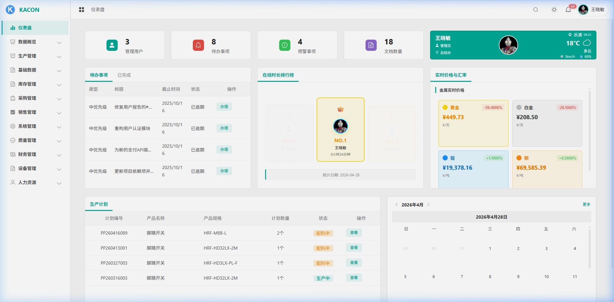
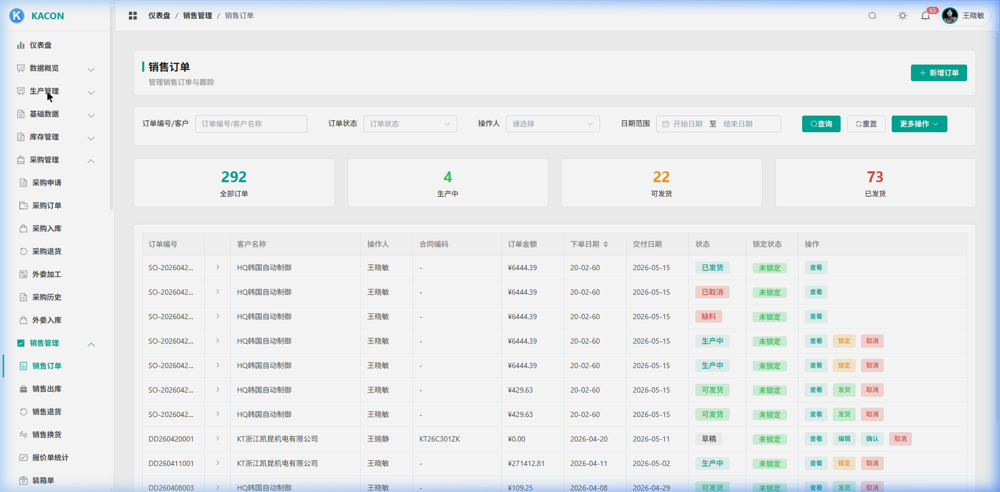
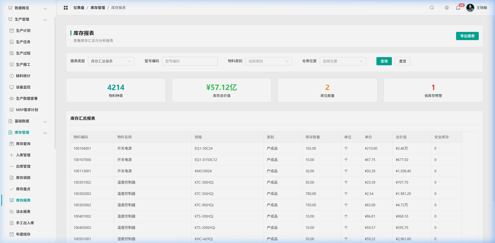
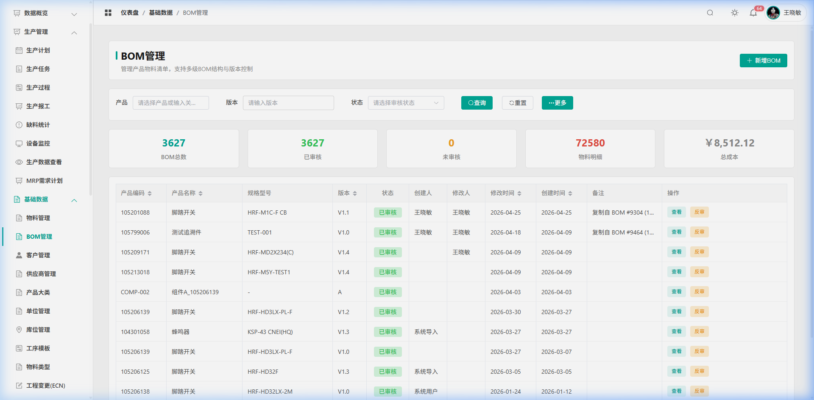
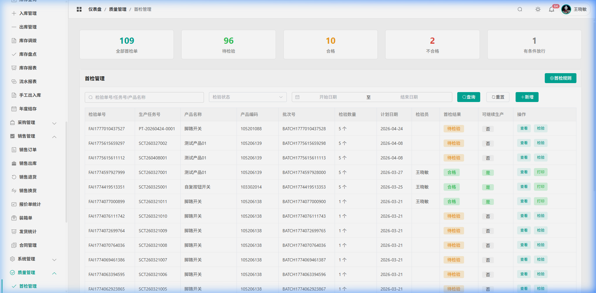
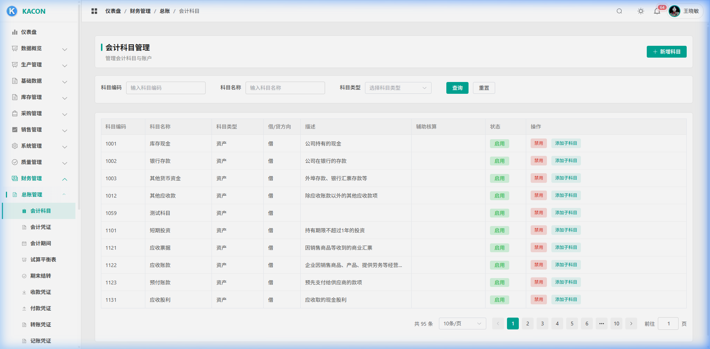
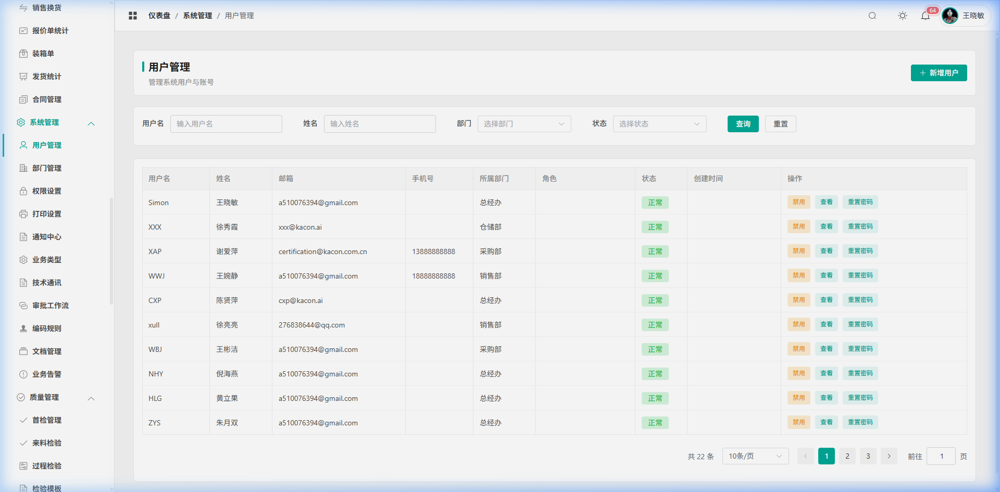

<div align="center">
  <h1>🏭 Enterprise ERP System</h1>
  <p><strong>🔥 Forever Free & Open Source | 永远免费开源的企业级 ERP 系统</strong></p>
  
  <p>
    
    
    
    
    
    
  </p>
  <p>
    <em>集成财务、采购、销售、库存、生产、质量管理的全功能企业资源计划系统。<br>
    通过第一性原理（数据库行锁、死信队列、物理防线）构建坚固业务闭环的工业级开源架构。</em>
  </p>
</div>

---

## 📸 系统预览

### 🏠 智能仪表盘
> 集成待办事项、生产计划预警、在线排行榜、实时金属价格/汇率行情、天气信息、日历等多维度数据看板，登录即可一目了然掌握全局。



### 💰 销售管理
> 完整的 O2C（Order-to-Cash）销售闭环：客户管理、报价单、销售订单（含状态流转：草稿→确认→生产中→可发货→已发货）、销售出库、退货/换货处理、装箱单管理。支持多状态筛选、订单锁定、批量操作。



### 📦 库存管理 (WMS)
> 4214 种物料、¥57.12 亿库存价值的实时监控。支持多仓多库位管理、入库/出库/调拨/盘点全流程、批次（LOT）追溯、先进先出（FIFO）成本核算、安全库存预警、库存汇总/明细/流水多维报表，一键导出 Excel。



### 🔧 BOM 管理 (多级配方)
> 3627 套 BOM、72580 条物料明细的精细化管理。支持 N 阶树状结构展开、版本控制（V1.0→V1.4）、审核流程、BOM 复制、成本汇总（¥8,512.12 总成本实时计算）、反向追溯"该物料被哪些 BOM 引用"。



### 🔬 质量管理 (QMS)
> 三道质量防线：IQC（来料检验）、IPQC（制程检验）、FQC（成品检验）。支持 AQL 标准定级判定、检验模板管理、不良品分析、质量追溯、首件检验、返工任务、报废记录。



### 🏦 财务核算
> 完整的企业财务体系：总账管理、会计凭证（自动生成+手工录入）、应收/应付账款、银行对账、费用管理、成本核算（制造费用分摊归集模型）、预算管理与执行分析、利润表/资产负债表/现金流量表自动生成。



### 🔐 系统底盘
> 纯正 RBAC 角色权限体系：细粒度菜单/按钮权限控制、多角色分配、部门组织架构管理。全局操作审计日志（谁在什么时间改了什么）、编码规则引擎（自动生成各类单据编号）、系统参数配置。



---

## 💎 核心架构亮点

<table>
<tr>
<td width="50%">

### 🛡️ 数据库行级悲观锁

在采购入库、生产领料、库存调拨、销售出库、质量检验、财务过账等 **19 个关键写入点** 原生启用 `SELECT ... FOR UPDATE` 行级排他锁。

当多个车间同时扫码领料同一批物料时，数据库底层物理阻塞排队，从根源上杜绝超发、超收、重复扣减。

```sql
-- 示例：库存扣减前锁定行
SELECT quantity FROM inventory_ledger
WHERE material_id = ? AND location_id = ?
FOR UPDATE
```

</td>
<td width="50%">

### 🔄 事件总线 + 死信队列

业务写入与财务记账完全解耦：工单报工、入库确认等操作 **50ms 内响应**，复杂的费用分摊、制造成本归集、科目余额重算通过 `EventBus` 异步触发 `FinanceSubscriber` 处理。

任务失败自动沉入 `sys_failed_jobs` 死信表，支持重试、人工干预、断点续算。哪怕服务器宕机重启，未完成的财务记账任务颗粒级可恢复，零数据丢失。

</td>
</tr>
<tr>
<td width="50%">

### 🖲️ 全链路审计 + 无感软删除

**30+ 业务模型** 全面启用 `deleted_at` 软删除，取缔一切物理 `DELETE`。`BaseService` 统一封装，新增模型自动继承。

`auditLogInterceptor` 中间件全局挂载，所有 POST/PUT/PATCH/DELETE 请求的操作人、时间、变更前后数据自动写入 `sys_audit_logs`。谁改了单价、谁删了订单，一条不漏。

</td>
<td width="50%">

### 🏦 会计期间刚性防线

`PeriodValidationService` 在凭证创建、费用报销、应收应付登记等入口严格校验会计期间状态。

已关账月份的历史凭证 **拒绝一切形式的补写、回填和时间倒拨**，从系统层面保障财务数据的法律严肃性。期末结转流程 (`PeriodEndService`) 自动生成结转凭证并锁定当期。

</td>
</tr>
<tr>
<td width="50%">

### ⚡ N+1 查询零容忍

经过 **4 轮全站深度性能审计**，累计扫描 200+ 后端文件，发现并消除 **17 处 N+1 查询瓶颈**（涵盖 MRP 引擎、成本核算、销售确认、预算分析等核心路径）。

统一采用「收集 ID → 批量 `WHERE IN` → 内存 `Map` 映射」模式，将 O(N) 级数据库交互压缩为 O(1) 常数次 SQL。

</td>
<td width="50%">

### 🔒 16 层纵深安全中间件

```
请求 → rateLimiter（速率限制）
     → csrfEnhanced（CSRF 防护）
     → securityEnhanced（XSS/注入过滤）
     → inputValidation（参数校验）
     → auth + JWT（身份认证）
     → requirePermission（RBAC 鉴权）
     → dataPermission（数据权限隔离）
     → auditLogInterceptor（审计记录）
     → performanceMonitor（性能监控）
     → Controller → Service → DB
```

每个请求经过层层过滤，从网络层到数据层全链路防护。

</td>
</tr>
</table>

---

## 📦 全息业务模块

| 模块 | 核心功能 |
| :--- | :--- |
| **⚙️ 生产制造 (MES)** | 生产计划 · 工单派发 · 车间报工 · 在线 WIP 制程快照 · 缺料反算 · 设备监控 · MRP 需求计划 |
| **🛒 采购协同 (P2P)** | 采购申请 · 询价比价 · 采购订单 · 到货入库（防超收）· 采购退货 · 外委加工 · 供应商管理 |
| **📦 销售流转 (O2C)** | 销售报价 · 销售订单 · 出库发货 · 装箱管理 · 退货/换货 · 客户信用额度 · 报价单统计 |
| **🏦 财务核算 (Finance)** | 总账凭证 · 应收/应付 · 银行对账 · 费用报销 · 成本核算 · 预算管理 · 三大报表 · 税务管理 |
| **📊 仓储管理 (WMS)** | 多仓库位 · 入库/出库/调拨/盘点 · 批次追溯 · FIFO 成本 · 安全库存预警 · 年度结存 · 库存分析报表 |
| **🔬 质量防线 (QMS)** | IQC/IPQC/FQC 三级检验 · AQL 判定 · 检验模板 · 首件检验 · 返工管理 · 报废记录 |
| **🗄️ 基础数据 (MDM)** | N 阶 BOM · 物料管理（16,986+）· 客户/供应商 · 多计量单位 · 库位管理 · 工序模板 · ECN 工程变更 |
| **🔐 系统底盘 (System)** | RBAC 权限 · 菜单管理 · 编码规则 · 审计日志 · 系统参数 · 数据字典 · 在线用户 |
| **👤 人力资源 (HR)** | 员工档案 · 考勤管理 · 部门组织架构 |
| **🖥️ 设备管理** | 设备台账 · 保养计划 · 维修记录 · 设备监控 |
| **📱 移动端 (Mobile)** | 基于 Vant 4 的响应式移动端，支持扫码报工、库存查询、审批等移动办公场景 |

---

## 🛠️ 技术栈

| 层 | 技术 |
| :--- | :--- |
| **前端** | Vue 3 + Vite + Element Plus + ECharts 5 + Pinia |
| **移动端** | Vue 3 + Vite + Vant 4（PWA 支持） |
| **后端** | Node.js 18 + Express + MySQL2 + Sequelize |
| **数据库** | MySQL 8.0（InnoDB 事务引擎） |
| **认证** | JWT (Access + Refresh Token) + RBAC |
| **部署** | Docker Compose 一键部署 |

---

## 🚀 快速开始

请确保已安装 **Node.js 18+** 和 **MySQL 8.0+**。

### 1. 克隆项目
```bash
git clone https://github.com/MarlynnLeo/Enterprise-ERP-System.git
cd Enterprise-ERP-System
```

### 2. 启动后端
```bash
cd backend
npm install

# 复制环境变量模板并填写数据库配置
cp .env.example .env
# 编辑 .env 填写 DB_HOST, DB_USER, DB_PASSWORD 等

# 初始化数据库（自动建表 + 预制数据）
npm run migrate

# 启动后端服务（默认 8080 端口）
npm run dev
```

### 3. 启动前端
```bash
cd ../frontend
npm install
npm run dev  # 默认 3000 端口
```

### 4. 启动移动端（可选）
```bash
cd ../mobile
npm install
npm run dev  # 默认 3001 端口
```

### 5. 访问系统
- **PC 端**: http://localhost:3000
- **移动端**: http://localhost:3001
- **管理员账号**: `admin` / `123456`

### Docker 一键部署
```bash
docker-compose up -d
```

---

## 📁 项目结构

```
Enterprise-ERP-System/
├── backend/                # 后端服务
│   ├── src/
│   │   ├── config/         # 数据库、Redis 等配置
│   │   ├── controllers/    # 业务控制器（按模块分组）
│   │   ├── services/       # 业务服务层
│   │   ├── models/         # 数据模型
│   │   ├── routes/         # API 路由
│   │   ├── middleware/     # 认证、审计、权限中间件
│   │   └── events/         # 事件总线 & 死信队列
│   └── .env.example        # 环境变量模板
├── frontend/               # PC 端前端
│   ├── src/
│   │   ├── views/          # 页面组件（按模块分组）
│   │   ├── components/     # 公共组件
│   │   ├── stores/         # Pinia 状态管理
│   │   ├── api/            # API 接口封装
│   │   └── composables/    # 组合式函数
│   └── .env.example
├── mobile/                 # 移动端
│   ├── src/
│   │   ├── views/          # Vant 移动页面
│   │   └── components/     # 移动端组件
│   └── .env.example
├── docs/                   # 文档 & 截图
├── docker-compose.yml      # Docker 编排
└── README.md
```

---

## 🤝 参与开源建设

本项目由一线制造业真实踩坑经验凝结而成。欢迎通过以下方式参与：

- 🐛 **提 Issue** — 反馈 Bug 或提出功能建议
- 🔧 **提 PR** — 贡献代码改进
- ⭐ **Star** — 如果觉得有用，请给个 Star 支持

---

## 📄 License

[MIT License](LICENSE) — 永久免费，可商用、可二开。

*Copyright © 2026. Made with ⚙️ and ❤️ for the Open Source Manufacturing Industry.*
